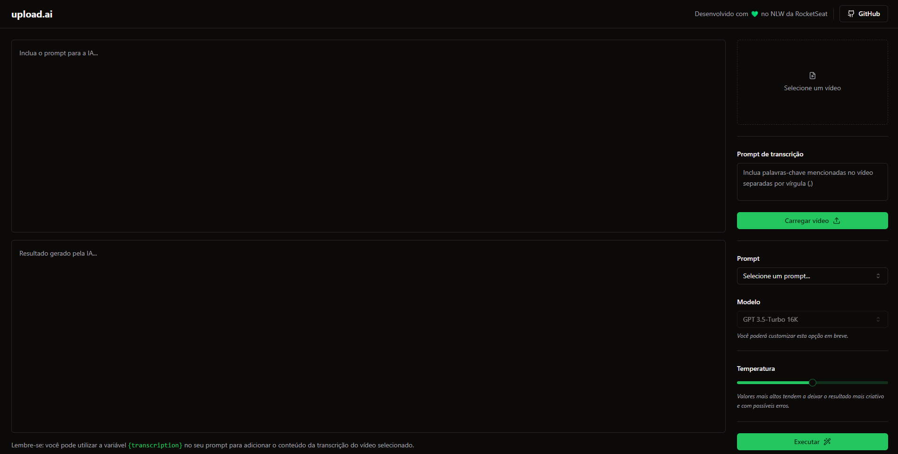

# upload.ai

Este projeto foi desenvolvido durante a NLW IA da Rocketseat.  

A ideia do projeto é  a seguinte: Enviamos um vídeo, adicionamos algumas palavras chaves e teremos uma leitura do vídeo por parte da IA, nos prompts temos algumas das funções disponíveis, como é o caso da Criação de Títulos para o Youtube ou Descrições.  

O funcionamento dele por trás dos panos é da seguinte forma: o vídeo é enviado, o que foi adicionado ao Prompt de Transcrição também é enviado.  
Após o início do processo (a depender da velocidade da máquina do usuário), o vídeo é convertido em MP3, é transcrito pela IA, logo após isso é carregado e pronto para atender às requisições do usuário.  

# projeto

<<<<<<< HEAD

=======

>>>>>>> ce4da20df112176615a82673b58910746e5f81ab

# frameworks 🛠️ 

React ⚛️ 
TailwindCSS 🎨 
Vite ⚡ 
Fastify 🚀 

# bibliotecas 📚
Axios 🌐 
Shadcn 🖼️ 
Radix 🖌️ 

# tecnologias 🔧
Node 🖥️ 
TypeScript 📝 
OpenAI: 🤖 
FFmpeg: 🔊 
<<<<<<< HEAD
Prisma 📊 
=======
Prisma 📊 
>>>>>>> ce4da20df112176615a82673b58910746e5f81ab
